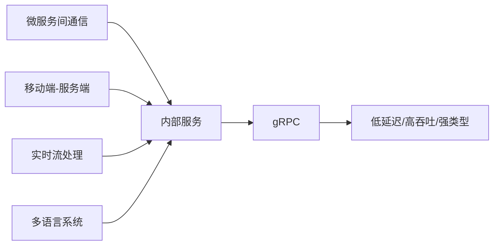

# gRPC 实战指南：从入门到生产部署

## 一、gRPC 概述

### 1.1 什么是 gRPC

gRPC 是 Google 开源的高性能 RPC 框架，基于 HTTP/2 协议传输，使用 Protocol Buffers 作为接口定义语言和序列化工具。自 2015 年开源以来，已成为微服务间通信的主流选择之一。

gRPC 的核心优势：

| 特性 | 说明 | 对比传统 REST |
|------|------|--------------|
| 传输协议 | HTTP/2 多路复用 | HTTP/1.1 队头阻塞 |
| 序列化 | Protobuf 二进制 | JSON/XML 文本 |
| 通信模式 | 4种模式（Unary/SS/CS/Bidi） | 仅 Request-Response |
| 接口契约 | .proto 文件强类型 | OpenAPI 文档 |
| 代码生成 | 自动生成客户端/服务端 | 需手动编写 |
| 性能 | 高（接近 TCP 性能） | 中（序列化开销大） |

### 1.2 适用场景



**推荐使用 gRPC 的场景：**
- 微服务间内部通信（南北流量）
- 需要流式处理（实时推送、日志流）
- 多语言异构系统集成
- IoT 设备与服务端通信
- 高性能计算节点间通信

**不推荐 gRPC 的场景：**
- 浏览器端直接调用（需 gRPC-Web 代理）
- 对外开放的 RESTful API
- 简单 CRUD 服务

## 二、Protocol Buffers 定义

### 2.1 .proto 文件设计

```protobuf
syntax = "proto3";

package order.v1;

option java_package = "com.example.order.v1";
option java_multiple_files = true;
option go_package = "order/v1;orderv1";

import "google/protobuf/timestamp.proto";
import "google/protobuf/wrappers.proto";

// 订单服务定义
service OrderService {
    // 创建订单 - Unary
    rpc CreateOrder(CreateOrderRequest) returns (OrderResponse);
    
    // 查询订单 - Unary
    rpc GetOrder(GetOrderRequest) returns (OrderResponse);
    
    // 订阅订单状态变更 - Server Streaming
    rpc SubscribeOrderStatus(SubscribeRequest) returns (stream OrderStatusEvent);
    
    // 批量上传订单 - Client Streaming
    rpc BatchCreateOrders(stream CreateOrderRequest) returns (BatchOrderResponse);
    
    // 实时订单聊天 - Bidirectional Streaming
    rpc OrderChat(stream ChatMessage) returns (stream ChatMessage);
}

// 订单实体
message Order {
    string order_id = 1;
    string user_id = 2;
    repeated OrderItem items = 3;
    Money total_amount = 4;
    OrderStatus status = 5;
    Address shipping_address = 6;
    google.protobuf.Timestamp created_at = 7;
    google.protobuf.Timestamp updated_at = 8;
}

message OrderItem {
    string product_id = 1;
    string product_name = 2;
    int32 quantity = 3;
    Money unit_price = 4;
    Money subtotal = 5;
}

message Money {
    string currency_code = 1;
    int64 units = 2;         // 整数部分
    int32 nanos = 3;          // 小数部分（纳秒精度）
}

enum OrderStatus {
    ORDER_STATUS_UNSPECIFIED = 0;
    ORDER_STATUS_PENDING = 1;
    ORDER_STATUS_PAID = 2;
    ORDER_STATUS_SHIPPED = 3;
    ORDER_STATUS_DELIVERED = 4;
    ORDER_STATUS_CANCELLED = 5;
}

message CreateOrderRequest {
    string user_id = 1;
    repeated OrderItem items = 2;
    Address shipping_address = 3;
    map<string, string> metadata = 4;
}

message OrderResponse {
    string order_id = 1;
    Order order = 2;
}

message GetOrderRequest {
    string order_id = 1;
}

message SubscribeRequest {
    string user_id = 1;
    repeated OrderStatus status_filter = 2;
}

message OrderStatusEvent {
    string order_id = 1;
    OrderStatus old_status = 2;
    OrderStatus new_status = 3;
    google.protobuf.Timestamp timestamp = 4;
}

message BatchOrderResponse {
    int32 total_count = 1;
    int32 success_count = 2;
    int32 failure_count = 3;
    repeated string order_ids = 4;
    repeated string errors = 5;
}

message ChatMessage {
    string message_id = 1;
    string sender = 2;
    string content = 3;
    google.protobuf.Timestamp timestamp = 4;
}

message Address {
    string street = 1;
    string city = 2;
    string state = 3;
    string zip_code = 4;
    string country = 5;
}
```

### 2.2 Protobuf 最佳实践

```protobuf
// ✅ 字段编号使用 1-15（占用1字节），常用字段优先
message User {
    string id = 1;          // 高频字段
    string name = 2;        // 高频字段
    string email = 3;       // 高频字段
    string phone = 16;      // 低频字段（16+ 占2字节）
    string address = 17;    // 低频字段
}

// ✅ 使用 optional 区分零值和空值
message SearchRequest {
    string query = 1;
    optional int32 page_size = 2;     // 0 和未设置的区别
    optional string sort_by = 3;
}

// ✅ 使用 oneof 表示互斥字段
message PaymentInfo {
    oneof payment_method {
        CreditCard card = 1;
        Alipay alipay = 2;
        WechatPay wechat = 3;
    }
}

// ❌ 避免频繁变更字段编号
// ❌ 避免使用 required（proto3 已废弃）
// ❌ 避免字段复用编号（使用 reserved）
message DeprecatedMessage {
    reserved 2, 3, 10 to 20;  // 保留已删除的字段
    reserved "old_field", "legacy_field";
    string new_field = 1;
}
```

## 三、服务端实现

### 3.1 Spring Boot 集成 gRPC

```xml
<dependency>
    <groupId>net.devh</groupId>
    <artifactId>grpc-server-spring-boot-starter</artifactId>
    <version>3.1.0.RELEASE</version>
</dependency>

<!-- Protobuf Maven 插件 -->
<plugin>
    <groupId>io.github.ascopes</groupId>
    <artifactId>protobuf-maven-plugin</artifactId>
    <version>2.1.1</version>
    <configuration>
        <protocVersion>3.25.3</protocVersion>
        <generateMainSources>true</generateMainSources>
    </configuration>
</plugin>
```

```yaml
# application.yml
grpc:
  server:
    port: 9090
    max-inbound-message-size: 10MB
    max-inbound-metadata-size: 8KB
    keepalive-time: 30s
    keepalive-timeout: 10s
    permit-keepalive-without-calls: true
  enable-reflection: true  # 开启反射（开发环境）
```

```java
@GrpcService
public class OrderGrpcService extends OrderServiceGrpc.OrderServiceImplBase {
    
    private final OrderRepository orderRepository;
    private final OrderEventPublisher eventPublisher;
    
    // Unary RPC
    @Override
    public void createOrder(CreateOrderRequest request, 
                           StreamObserver<OrderResponse> responseObserver) {
        try {
            Order order = convertToEntity(request);
            Order savedOrder = orderRepository.save(order);
            eventPublisher.publishOrderCreated(savedOrder);
            
            responseObserver.onNext(OrderResponse.newBuilder()
                    .setOrderId(savedOrder.getOrderId())
                    .setOrder(convertToProto(savedOrder))
                    .build());
            responseObserver.onCompleted();
        } catch (Exception e) {
            responseObserver.onError(Status.INTERNAL
                    .withDescription("订单创建失败: " + e.getMessage())
                    .asRuntimeException());
        }
    }
    
    // Server Streaming RPC
    @Override
    public void subscribeOrderStatus(SubscribeRequest request,
                                    StreamObserver<OrderStatusEvent> responseObserver) {
        var subscription = eventPublisher.subscribe(request.getUserId())
                .filter(event -> request.getStatusFilterList().isEmpty() || 
                        request.getStatusFilterList().contains(event.getNewStatus()))
                .subscribe(
                    event -> responseObserver.onNext(event),
                    error -> responseObserver.onError(error),
                    () -> responseObserver.onCompleted()
                );
        
        // 在上下文中注册取消回调
        Context.current().addListener(
            context -> subscription.dispose(),
            MoreExecutors.directExecutor()
        );
    }
    
    // Client Streaming RPC
    @Override
    public StreamObserver<CreateOrderRequest> batchCreateOrders(
            StreamObserver<BatchOrderResponse> responseObserver) {
        return new StreamObserver<>() {
            private int total = 0;
            private int success = 0;
            private int failure = 0;
            private final List<String> orderIds = new ArrayList<>();
            private final List<String> errors = new ArrayList<>();
            
            @Override
            public void onNext(CreateOrderRequest request) {
                total++;
                try {
                    Order order = orderRepository.save(convertToEntity(request));
                    success++;
                    orderIds.add(order.getOrderId());
                } catch (Exception e) {
                    failure++;
                    errors.add("第" + total + "个订单失败: " + e.getMessage());
                }
            }
            
            @Override
            public void onError(Throwable t) {
                responseObserver.onError(t);
            }
            
            @Override
            public void onCompleted() {
                responseObserver.onNext(BatchOrderResponse.newBuilder()
                        .setTotalCount(total)
                        .setSuccessCount(success)
                        .setFailureCount(failure)
                        .addAllOrderIds(orderIds)
                        .addAllErrors(errors)
                        .build());
                responseObserver.onCompleted();
            }
        };
    }
}
```

### 3.2 拦截器实现

```java
// 日志拦截器
@GrpcGlobalServerInterceptor
public class LoggingInterceptor implements ServerInterceptor {
    
    private static final Logger log = LoggerFactory.getLogger(LoggingInterceptor.class);
    
    @Override
    public <ReqT, RespT> ServerCall.Listener<ReqT> interceptCall(
            ServerCall<ReqT, RespT> call,
            Metadata headers,
            ServerCallHandler<ReqT, RespT> next) {
        
        String methodName = call.getMethodDescriptor().getFullMethodName();
        log.info("gRPC 请求开始: method={}", methodName);
        
        long startTime = System.currentTimeMillis();
        
        ServerCall<ReqT, RespT> wrappedCall = new ForwardingServerCall.SimpleForwardingServerCall<>(call) {
            @Override
            public void close(Status status, Metadata trailers) {
                long duration = System.currentTimeMillis() - startTime;
                log.info("gRPC 请求结束: method={}, status={}, duration={}ms",
                        methodName, status.getCode(), duration);
                super.close(status, trailers);
            }
        };
        
        return next.startCall(wrappedCall, headers);
    }
}

// 认证拦截器
@GrpcGlobalServerInterceptor
public class AuthInterceptor implements ServerInterceptor {
    
    private static final String AUTH_TOKEN_KEY = "authorization";
    
    @Override
    public <ReqT, RespT> ServerCall.Listener<ReqT> interceptCall(
            ServerCall<ReqT, RespT> call,
            Metadata headers,
            ServerCallHandler<ReqT, RespT> next) {
        
        String token = headers.get(Metadata.Key.of(AUTH_TOKEN_KEY, 
                Metadata.ASCII_STRING_MARSHALLER));
        
        if (token == null || !validateToken(token)) {
            call.close(Status.UNAUTHENTICATED
                    .withDescription("无效的认证令牌"), new Metadata());
            return new ServerCall.Listener<>() {};
        }
        
        // 将用户信息注入到 Context
        var context = Context.current()
                .withValue(USER_ID_KEY, extractUserId(token));
        
        return Contexts.interceptCall(context, call, headers, next);
    }
}
```

## 四、客户端实现

### 4.1 客户端配置

```java
@Configuration
public class GrpcClientConfiguration {
    
    @Bean
    public ManagedChannel orderServiceChannel() {
        return ManagedChannelBuilder.forAddress("localhost", 9090)
                .usePlaintext()  // 生产环境使用 TLS
                .keepAliveTime(30, TimeUnit.SECONDS)
                .keepAliveTimeout(10, TimeUnit.SECONDS)
                .maxInboundMessageSize(10 * 1024 * 1024)
                .enableRetry()   // 启用自动重试
                .build();
    }
    
    @Bean
    public OrderServiceGrpc.OrderServiceBlockingStub blockingStub() {
        return OrderServiceGrpc.newBlockingStub(orderServiceChannel());
    }
    
    @Bean
    public OrderServiceGrpc.OrderServiceStub asyncStub() {
        return OrderServiceGrpc.newStub(orderServiceChannel());
    }
    
    @Bean
    public OrderServiceGrpc.OrderServiceFutureStub futureStub() {
        return OrderServiceGrpc.newFutureStub(orderServiceChannel());
    }
}
```

### 4.2 四种通信模式客户端

```java
@Service
public class OrderGrpcClient {
    
    private final OrderServiceGrpc.OrderServiceBlockingStub blockingStub;
    private final OrderServiceGrpc.OrderServiceStub asyncStub;
    private final OrderServiceGrpc.OrderServiceFutureStub futureStub;
    
    // 1. Unary RPC
    public OrderResponse createOrder(CreateOrderRequest request) {
        return blockingStub.createOrder(request);
    }
    
    // 2. Server Streaming
    public void subscribeOrderStatus(String userId, 
                                     Consumer<OrderStatusEvent> callback) {
        SubscribeRequest request = SubscribeRequest.newBuilder()
                .setUserId(userId)
                .build();
        
        asyncStub.subscribeOrderStatus(request, new StreamObserver<>() {
            @Override
            public void onNext(OrderStatusEvent event) {
                callback.accept(event);
            }
            
            @Override
            public void onError(Throwable t) {
                log.error("订阅异常: {}", t.getMessage());
                // 自动重连逻辑
            }
            
            @Override
            public void onCompleted() {
                log.info("订阅结束");
            }
        });
    }
    
    // 3. Client Streaming
    public BatchOrderResponse batchCreateOrders(List<CreateOrderRequest> requests) {
        CountDownLatch latch = new CountDownLatch(1);
        AtomicReference<BatchOrderResponse> result = new AtomicReference<>();
        
        StreamObserver<CreateOrderRequest> requestObserver = 
            asyncStub.batchCreateOrders(new StreamObserver<>() {
                @Override
                public void onNext(BatchOrderResponse response) {
                    result.set(response);
                }
                
                @Override
                public void onError(Throwable t) {
                    log.error("批量创建失败", t);
                    latch.countDown();
                }
                
                @Override
                public void onCompleted() {
                    latch.countDown();
                }
            });
        
        requests.forEach(request -> {
            requestObserver.onNext(request);
        });
        requestObserver.onCompleted();
        
        try {
            latch.await(30, TimeUnit.SECONDS);
        } catch (InterruptedException e) {
            Thread.currentThread().interrupt();
        }
        
        return result.get();
    }
    
    // 4. Bidirectional Streaming
    public void startOrderChat(String userId, 
                               String messageContent,
                               Consumer<ChatMessage> messageHandler) {
        ChatSession session = new ChatSession(userId, messageHandler);
        
        StreamObserver<ChatMessage> serverMessages = 
            asyncStub.orderChat(session.getClientObserver());
        
        session.setServerObserver(serverMessages);
        
        // 发送第一条消息
        session.sendMessage(messageContent);
    }
}
```

## 五、高级特性

### 5.1 负载均衡

```java
// 客户端负载均衡配置
ManagedChannel channel = ManagedChannelBuilder
    .forTarget("dns:///order-service:9090")
    .defaultLoadBalancingPolicy("round_robin")
    .nameResolverFactory(new DnsNameResolverProvider())
    .build();

// 或者使用 gRPC LB 策略
ManagedChannel channel = ManagedChannelBuilder
    .forTarget("static:///192.168.1.1:9090,192.168.1.2:9090,192.168.1.3:9090")
    .defaultLoadBalancingPolicy("round_robin")
    .build();
```

### 5.2 健康检查

```protobuf
// 健康检查协议（标准库）
service Health {
    rpc Check(HealthCheckRequest) returns (HealthCheckResponse);
    rpc Watch(HealthCheckRequest) returns (stream HealthCheckResponse);
}

message HealthCheckRequest {
    string service = 1;
}

message HealthCheckResponse {
    enum ServingStatus {
        UNKNOWN = 0;
        SERVING = 1;
        NOT_SERVING = 2;
        SERVICE_UNKNOWN = 3;
    }
    ServingStatus status = 1;
}
```

```yaml
# Spring Boot 配置
grpc:
  server:
    health-service-enabled: true
    reflection-service-enabled: true
```

### 5.3 超时与重试

```java
// 客户端超时配置
OrderResponse response = blockingStub
    .withDeadlineAfter(5, TimeUnit.SECONDS)
    .withInterceptors(new RetryInterceptor())
    .createOrder(request);

// 重试配置
@Bean
public RetryInterceptor retryInterceptor() {
    return new RetryInterceptor() {
        @Override
        protected boolean shouldRetry(Status status, int attempt) {
            return attempt < 3 && 
                   (status.getCode() == Status.Code.UNAVAILABLE ||
                    status.getCode() == Status.Code.DEADLINE_EXCEEDED);
        }
        
        @Override
        protected long getBackoffDelay(int attempt) {
            return (long) Math.pow(2, attempt) * 100; // 200ms, 400ms, 800ms
        }
    };
}
```

### 5.4 安全性

```java
// TLS 配置
ManagedChannel secureChannel = GrpcSslContexts
    .forClient()
    .trustManager(new File("ca-cert.pem"))
    .build()
    .map(sslContext -> ManagedChannelBuilder
            .forAddress("api.example.com", 443)
            .sslContext(sslContext)
            .build())
    .getOrThrow();

// mTLS 双向认证
ManagedChannel mtlsChannel = GrpcSslContexts
    .forClient()
    .trustManager(new File("ca-cert.pem"))
    .keyManager(new File("client-cert.pem"), new File("client-key.pem"))
    .build()
    .map(...)
```

## 六、监控与可观测性

### 6.1 指标采集

```java
@GrpcGlobalServerInterceptor
public class MetricsInterceptor implements ServerInterceptor {
    
    private final Counter requestCounter;
    private final Histogram requestDuration;
    
    public MetricsInterceptor(MeterRegistry registry) {
        requestCounter = Counter.builder("grpc.server.requests.total")
                .description("Total gRPC requests")
                .register(registry);
        
        requestDuration = Histogram.builder("grpc.server.requests.duration")
                .description("Request duration in seconds")
                .register(registry);
    }
    
    @Override
    public <ReqT, RespT> ServerCall.Listener<ReqT> interceptCall(
            ServerCall<ReqT, RespT> call,
            Metadata headers,
            ServerCallHandler<ReqT, RespT> next) {
        
        requestCounter.increment();
        long startTime = System.nanoTime();
        
        ServerCall<ReqT, RespT> wrappedCall = new ForwardingServerCall.SimpleForwardingServerCall<>(call) {
            @Override
            public void close(Status status, Metadata trailers) {
                requestDuration.record(
                    (System.nanoTime() - startTime) / 1_000_000_000.0);
                super.close(status, trailers);
            }
        };
        
        return next.startCall(wrappedCall, headers);
    }
}
```

### 6.2 分布式追踪

```java
@GrpcGlobalServerInterceptor
public class TracingInterceptor implements ServerInterceptor {
    
    private final Tracer tracer;
    
    @Override
    public <ReqT, RespT> ServerCall.Listener<ReqT> interceptCall(
            ServerCall<ReqT, RespT> call,
            Metadata headers,
            ServerCallHandler<ReqT, RespT> next) {
        
        // 提取上游 span 上下文
        SpanContext parentSpan = extractSpanContext(headers);
        
        Span span = tracer.buildSpan(call.getMethodDescriptor().getFullMethodName())
                .asChildOf(parentSpan)
                .withTag("rpc.system", "grpc")
                .start();
        
        try (Scope scope = tracer.activateSpan(span)) {
            return next.startCall(call, headers);
        } catch (Exception e) {
            span.log("error: " + e.getMessage());
            throw e;
        } finally {
            span.finish();
        }
    }
}
```

## 七、性能对比

### 7.1 gRPC vs REST 基准测试

| 指标 | gRPC (Protobuf) | REST (JSON) | 提升比例 |
|------|----------------|-------------|---------|
| 延迟 (p50) | 2.3ms | 8.7ms | 73.6% |
| 延迟 (p99) | 15.1ms | 52.3ms | 71.1% |
| 吞吐量 | 45,000 req/s | 12,000 req/s | 275% |
| 带宽占用 | 1.2 MB/s | 8.5 MB/s | 85.9% |
| CPU使用率 | 65% | 72% | 9.7% |
| 内存占用 | 512 MB | 480 MB | -6.7% |

测试环境：4C8G 虚拟机, 1000并发客户端, 1KB payload

### 7.2 不同序列化方式对比

| 序列化方式 | 序列化耗时 | 反序列化耗时 | 数据大小 | 适用场景 |
|-----------|-----------|-------------|---------|---------|
| Protobuf | 0.8μs | 1.2μs | 128 bytes | 内部服务通信 |
| FlatBuffers | 0.1μs | 0.1μs | 144 bytes | 游戏/实时场景 |
| Avro | 1.5μs | 2.0μs | 135 bytes | 大数据场景 |
| JSON | 4.5μs | 5.8μs | 356 bytes | 浏览器/外部API |
| Thrift | 1.0μs | 1.5μs | 132 bytes | 跨语言通信 |

## 八、常见陷阱与解决方案

| 问题 | 原因 | 解决方案 |
|------|------|---------|
| 连接泄漏 | ManagedChannel 未正确关闭 | 使用 try-with-resources 或注册 shutdown hook |
| 内存溢出 | 未限制消息大小 | 设置 maxInboundMessageSize |
| 连接丢失 | 未配置 KeepAlive | 配置 keepalive-time + keepalive-timeout |
| 序列化异常 | 字段变更未兼容 | 遵循 Protobuf 兼容规则，使用 reserved |
| 服务雪崩 | 未配置超时 | 设置 Deadline，使用 Resilience4j |
| 调试困难 | 二进制协议不可读 | 启用 Reflection，使用 grpcurl 工具 |

## 总结

gRPC 凭借 HTTP/2、Protobuf、流式通信等核心技术，为微服务架构提供了高性能、强类型的 RPC 解决方案。在生产环境中，需要注意超时控制、负载均衡、安全传输、监控告警等非功能性需求。合理评估业务场景，在适合的地方使用 gRPC，能够显著提升服务间通信的效率。
