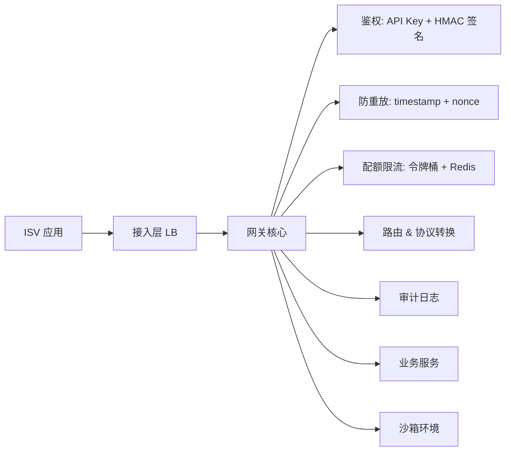

# 【架构设计】开放平台 API 网关设计：签名鉴权、配额限流与审计治理

## 面试官：如果公司要把核心能力开放出去，比如开放给第三方 ISV 调用，网关该怎么设计？

这道题的关键词不是"网关"，而是"**开放**"。内部网关只需要做路由和灰度，而开放网关要面对一群**不受你控制的调用方**：他们可能写错代码、可能疯狂重试、可能是竞争对手在爬数据、也可能拿着泄露的密钥干坏事。

所以开放平台网关的核心命题是四件事：**你是谁（鉴权）、你能调多少（配额）、你调了什么（审计）、出事我怎么止血（治理）**。本文逐层展开，配 Java 代码与限流算法对比。

---

## 一、整体分层



| 层级 | 职责 | 关键设计 |
| --- | --- | --- |
| 接入层 | 负载均衡、TLS 卸载 | 与内部网关物理隔离 |
| 鉴权层 | 身份认证、权限校验 | appId/appSecret、签名、scope |
| 流控层 | 配额、限流、熔断 | 多维限流、集群限流 |
| 路由层 | 版本、灰度、协议转换 | URL 版本、参数映射 |
| 可观测层 | 审计、计费、告警 | 全量日志、调用统计 |

---

## 二、鉴权：从简单的 API Key 到 HMAC 签名

### 1. 为什么不能只用一个 API Key

如果 `appId` + `appSecret` 直接放在请求头里传，一旦被截获（日志、代理、中间人），攻击者就能无限调用。所以**密钥永远不参与传输**，只用来做签名计算。

### 2. HMAC 签名方案

请求参数：

```
appId      = 10001
timestamp  = 1728532800000   (毫秒，服务端允许 ±5 分钟)
nonce      = a1b2c3d4        (随机串，防重放)
method     = POST
path       = /open/v1/order/create
body       = {"skuId":"1001","qty":1}
sign       = HMAC-SHA256(secret, 待签串)
```

**待签串构造规则**（顺序必须固定）：

```
signStr = method + "\n" + path + "\n" + sortedQueryString + "\n"
        + appId + "\n" + timestamp + "\n" + nonce + "\n"
        + sha256(body)
```

选择 `sha256(body)` 而不是原始 body，是为了**统一长度、避免超长字符串参与签名**，同时保证 body 被篡改时签名失效。

```java
public class SignUtil {

    public static String buildSignStr(String method, String path,
                                      Map<String, String> query,
                                      String appId, long timestamp,
                                      String nonce, String body) {
        String sortedQuery = query.entrySet().stream()
                .sorted(Map.Entry.comparingByKey())
                .map(e -> e.getKey() + "=" + e.getValue())
                .collect(Collectors.joining("&"));
        String bodyHash = sha256Hex(body == null ? "" : body);
        return String.join("\n", method, path, sortedQuery,
                appId, String.valueOf(timestamp), nonce, bodyHash);
    }

    public static String sign(String secret, String signStr) {
        Mac mac = Mac.getInstance("HmacSHA256");
        mac.init(new SecretKeySpec(secret.getBytes(StandardCharsets.UTF_8), "HmacSHA256"));
        return Hex.toHexString(mac.doFinal(signStr.getBytes(StandardCharsets.UTF_8)));
    }

    public static boolean verify(String secret, String signStr, String expected) {
        // 必须用常量时间比较，防止时序攻击
        return MessageDigest.isEqual(
                sign(secret, signStr).getBytes(StandardCharsets.UTF_8),
                expected.getBytes(StandardCharsets.UTF_8));
    }
}
```

> **细节加分项**：`MessageDigest.isEqual` 而不是 `String.equals`。后者遇到第一个不同字符就返回，攻击者可以通过耗时差异逐字节爆破签名——这就是"时序攻击"。面试里主动提这个点，很出彩。

### 3. 防重放

签名解决"篡改"，`timestamp + nonce` 解决"重放"：

```java
public void checkReplay(String appId, long timestamp, String nonce) {
    long now = System.currentTimeMillis();
    if (Math.abs(now - timestamp) > 5 * 60 * 1000) {
        throw new BizException("请求已过期");
    }
    // nonce 在 TTL 窗口内只允许出现一次，SETNX 天然原子
    Boolean ok = redis.opsForValue()
            .setIfAbsent("nonce:" + appId + ":" + nonce, "1", Duration.ofMinutes(10));
    if (!Boolean.TRUE.equals(ok)) {
        throw new BizException("重复请求");
    }
}
```

**为什么 nonce 的 TTL 要略大于 timestamp 窗口？** 因为只要请求在 5 分钟窗口内都合法，nonce 就必须被记录至少 5 分钟。给到 10 分钟是留了时钟漂移和网络抖动的余量。

---

## 三、配额与限流：开放平台最容易被刷爆的地方

### 1. 多维度限流模型

| 维度 | 示例 | 超限处理 |
| --- | --- | --- |
| 应用维度 | appId 每秒 1000 次 | 429 Too Many Requests |
| 接口维度 | 某接口单应用 QPS 上限 | 429 或排队 |
| 日配额 | 每天 10 万次调用 | 403 + 计费提示 |
| 全局维度 | 平台总容量 | 兜底保护 |
| 来源 IP | 单 IP 并发限制 | 封禁 |

配额是**计费与商务策略的载体**，所以它必须在网关统一实现，不能散落到业务服务里。

### 2. 算法选择

| 算法 | 突发流量 | 平滑性 | 实现复杂度 | 适用 |
| --- | --- | --- | --- | --- |
| 固定窗口 | 差（临界突刺） | 差 | 低 | 简单场景 |
| 滑动窗口 | 中 | 中 | 中 | 通用限流 |
| 漏桶 | 好（恒定速率） | 最好 | 中 | 流量整形 |
| 令牌桶 | **允许突发** | 好 | 中 | **开放平台首选** |

开放平台一般用**令牌桶**：允许 ISV 短时突发（正常的批量任务确实会突发），但长期平均速率被限制。

Redis + Lua 实现滑动窗口计数器：

```java
// 滑动窗口：ZSET 存时间戳，score = 毫秒时间戳
private static final String SLIDING_WINDOW_LUA =
    "local key = KEYS[1] " +
    "local now = tonumber(ARGV[1]) " +
    "local window = tonumber(ARGV[2]) " +
    "local limit = tonumber(ARGV[3]) " +
    "redis.call('ZREMRANGEBYSCORE', key, 0, now - window) " +  // 清理过期
    "local cnt = redis.call('ZCARD', key) " +
    "if cnt < limit then " +
    "  redis.call('ZADD', key, now, now .. ':' .. ARGV[4]) " +
    "  redis.call('PEXPIRE', key, window) " +
    "  return 1 " +
    "end " +
    "return 0";

public boolean tryAcquire(String appId, String api, int limitPerSecond) {
    long now = System.currentTimeMillis();
    String key = "quota:" + appId + ":" + api;
    Long r = redis.execute(new DefaultRedisScript<>(SLIDING_WINDOW_LUA, Long.class),
            Collections.singletonList(key),
            String.valueOf(now), "1000", String.valueOf(limitPerSecond),
            UUID.randomUUID().toString());
    return r != null && r == 1L;
}
```

> `ZREMRANGEBYSCORE` 清理 + `ZCARD` 计数 + `ZADD` 写入，三条命令必须在一个 Lua 脚本里，否则并发下三步骤之间会产生竞态。

### 3. 集群限流

单机限流在网关水平扩展后会失效（10 台机器，单机 100 QPS，总量就变成 1000）。两种集群限流做法：

- **Redis 集中式**：精度高，但 Redis 成为热点，需要分片；
- **令牌集中发放 + 本地消费**：Redis 只负责发令牌（比如每秒发 N 个），网关本地扣减，减少 Redis 访问。缺点是单机之间分配不均（可通过"借还机制"缓解）。

---

## 四、路由与版本管理

开放平台的 API 一旦发布就**不能随便改**，因为调用方是第三方。

| 策略 | 说明 |
| --- | --- |
| URL 版本 | `/open/v1/order/create`，最直观 |
| Header 版本 | `X-API-Version: 1`，URL 干净 |
| 灰度路由 | 按 appId 白名单灰度新版本 |
| 参数兼容 | 新增字段可选，不删字段、不改语义 |

网关里做版本路由：

```java
public String route(RouteContext ctx) {
    String version = ctx.getPath().matches("/open/v\\d+/.+")
            ? ctx.getPath().replaceAll("/open/(v\\d+)/.*", "$1")
            : "v1";
    String target = registry.lookup(ctx.getService(), version);
    if (target == null) {
        throw new BizException("不支持的版本: " + version);
    }
    return target;
}
```

---

## 五、审计与计费

开放平台必须回答"**谁在什么时候调了什么、耗了多少资源**"，用于：排障、计费、安全溯源、SLA 统计。

### 1. 审计日志字段

```java
public class ApiAuditLog {
    private String requestId;     // 全局唯一，贯穿全链路
    private String appId;
    private String api;
    private String version;
    private String clientIp;
    private long   timestamp;
    private int    httpStatus;
    private long   costMs;
    private String errorCode;     // 业务错误码
    private boolean signVerified;
    private String requestDigest; // body 摘要，不存原文（脱敏）
}
```

### 2. 写入策略

**审计日志绝对不能同步写 DB**——它是全量的，量级和业务 QPS 同阶。正确做法：

1. 网关异步写入 Kafka（或本地 RingBuffer + 批量 flush）；
2. 消费端落 ClickHouse / ES 做聚合分析；
3. 计费用的**调用量计数器**单独走 Redis 原子累加（`HINCRBY`，按 appId+日 维度），定时对账落库。

```java
// 计费计数：按 appId + 自然日 累加，原子且高效
public long countAndGet(String appId) {
    String key = "billing:" + appId + ":" + LocalDate.now();
    Long n = redis.opsForHash().increment(key, "count", 1);
    redis.expire(key, Duration.ofDays(40));
    return n == null ? 0 : n;
}
```

---

## 六、稳定性治理

| 风险 | 手段 |
| --- | --- |
| 单 ISV 打爆平台 | 多维限流 + 熔断（Resilience4j / Sentinel） |
| 下游服务慢 | 超时 + 隔离（线程池/信号量）+ 快速失败 |
| 密钥泄露 | 密钥轮换、IP 白名单、scope 最小权限 |
| 恶意爬取 | 风控规则、行为分析、验证码升级 |
| 新接入出错 | **沙箱环境** + 审核流程 |

### 沙箱环境设计

第三方接入最关键的一环：**沙箱**。要点：

- 独立的一套数据与额度，与生产完全隔离；
- 支持"一键重置"测试数据；
- 沙箱与生产的唯一差异是域名，签名算法、错误码、返回结构完全一致。

```java
public String resolveEndpoint(String appId) {
    return sandboxRegistry.isSandbox(appId)
            ? "https://sandbox-open.example.com"
            : "https://open.example.com";
}
```

---

## 七、面试常见追问

**Q1：签名为什么用 HMAC 而不是 RSA？**
答：HMAC 是对称的，性能高（一次哈希 + 异或），适合服务端与 ISV 共享密钥的场景。RSA 非对称签名优势在于"验证方不需要持有签名私钥"，适合"平台签名给 ISV 验签"的单向场景（如回调通知）。开放平台通常是**双向**的：ISV 调平台用 HMAC，平台回调 ISV 用 RSA 或另一套 HMAC 密钥。

**Q2：为什么 body 参与签名时先做 sha256？**
答：避免超长字符串参与签名计算（大 body 会导致签名耗时不可控），同时统一了不同编码/换行带来的差异。

**Q3：限流返回 429 还是 200 带错误码？**
答：**429** + `Retry-After` 头。HTTP 语义正确，ISV 的 HTTP 客户端和 SDK 能直接识别并退避。用 200 带错误码会让重试逻辑混乱。

**Q4：网关怎么做到不影响业务迭代速度？**
答：网关只做**横切关注点**（鉴权、限流、审计、路由），绝不做业务逻辑。业务逻辑一旦进网关，网关就成了新的单体。这是开放平台架构的第一原则。

**Q5：如何防止 ISV 伪造 timestamp 绕过防重放？**
答：timestamp 本身参与签名，并且服务端做 ±5 分钟窗口校验。攻击者改 timestamp 就改不了签名（没有 secret），保持 timestamp 则 nonce 唯一性会拦住重放。

---

## 总结

开放平台网关的设计可以浓缩成一张清单：

1. **鉴权**：appId + HMAC 签名 + timestamp/nonce 防重放，常量时间比较；
2. **配额**：多维度限流，令牌桶允许突发，集群场景用集中发放或 Redis 分布式计数；
3. **版本**：URL/Header 版本 + 灰度路由 + 向后兼容；
4. **审计**：全量异步日志入列，计费计数走 Redis 原子累加；
5. **治理**：熔断隔离、密钥轮换、IP 白名单、沙箱环境。

面试时先抛出这五个词，再逐个展开，节奏感会非常好。
