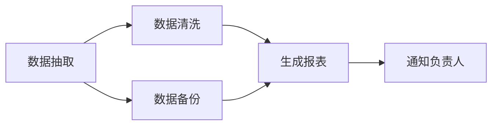

# 【任务调度】PowerJob 分布式调度框架深度实战：从架构原理到与 XXL-Job 全面对比

## 从定时任务的三次进化说起

第一代：单机 `@Scheduled` + `cron`。简单，但**不支持集群**——多实例部署时任务会重复执行，只能靠数据库锁"硬扛"。

第二代：分布式调度框架（Quartz 集群、XXL-Job、Elastic-Job）。解决了**调度中心化、任务分发、失败重试**。

第三代：**分布式计算**。任务不只是"定时执行"，还要**分片并行处理百万级数据**。这就是 PowerJob 的主场。

**PowerJob**（原 OhMyScheduler）是阿里巴巴开源（Gitee GVP 项目）的分布式调度与计算框架，核心特性：

- **分布式计算**：Map / MapReduce 任务模型，百万数据分片并行处理
- **工作流编排**：DAG 依赖、条件分支
- **超高可用**：调度器（Server）本身可集群，无中心化单点
- **可视化控制台**：秒级任务状态、在线日志、手动触发

一句话概括：**XXL-Job 解决"分布式定时调度"，PowerJob 更进一步解决"分布式定时计算"。**

---

## 一、架构总览

### 1.1 核心组件

```
┌─────────────────────────────────────────────┐
│              PowerJob 控制台（Web）           │
│   任务管理 / 工作流编排 / 在线日志 / 监控     │
└──────────────────┬──────────────────────────┘
                   │ HTTP/RPC
┌──────────────────▼──────────────────────────┐
│           PowerJob Server（调度中心）         │
│   任务调度引擎（Quartz + 自研时间轮）          │
│   任务分发 / 故障转移 / 工作流引擎            │
│   集群模式：多 Server 互备（基于 Akka）       │
└──────────────────┬──────────────────────────┘
                   │ 长连接（Akka Remoting / gRPC）
   ┌───────────────┼───────────────┐
┌──▼───┐       ┌──▼───┐       ┌──▼───┐
│Worker│       │Worker│       │Worker│   ← 执行器（业务应用）
└──────┘       └──────┘       └──────┘   无需注册中心，Server 主动发现
```

- **Server（调度中心）**：负责任务调度、分发、状态管理。可多台部署成集群，节点间通过一致性协议选主，**调度任务不丢不重**。
- **Worker（执行器）**：嵌入业务应用的组件，启动后向 Server 上报，**通过长连接接收任务指令**，执行结果回传。
- **控制台**：前端管理界面，管理任务、查看日志、手动触发、追踪工作流。

### 1.2 与 XXL-Job 的核心差异（先记住这个表）

| 维度 | PowerJob | XXL-Job |
|------|----------|---------|
| 通信模型 | Server 主动推（长连接） | Worker 定时拉（心跳轮询） |
| 任务模型 | 单机/广播/分片/**Map/MapReduce** | 单机/广播/分片（无 MapReduce） |
| 工作流 | ✅ DAG + 条件分支 | ❌ 不支持（需自研或借助 XXL-Job 的父子任务） |
| 调度精度 | 秒级 | 秒级 |
| 运维控制台 | 现代 Web（Vue3），支持在线日志流式查看 | 经典 JSP，功能朴实 |
| 日志 | 在线流式查看 + 持久化 | 在线查看（文件方式） |
| 集群容错 | Server 集群 + Worker 无状态 | Admin 集群 + 执行器注册 |
| 开源活跃度 | 高（阿里维护，Gitee GVP） | 高（许雪里维护，用户量大） |

---

## 二、快速上手：Spring Boot 集成

### 2.1 依赖与配置

```xml
<dependency>
    <groupId>tech.powerjob</groupId>
    <artifactId>powerjob-worker-spring-boot-starter</artifactId>
    <version>4.3.9</version>
</dependency>
```

```yaml
powerjob:
  worker:
    app-name: order-app                 # 应用名，与控制台一致
    server-address: 127.0.0.1:7700      # Server 地址（可多个，逗号分隔）
    protocol: akka                      # 或 http
    # 单机最大可运行的线程数
    max-worker-threads: 64
    # 工作线程池核心/最大线程数
    core-thread-num: 8
    max-thread-num: 64
```

### 2.2 第一个任务：BasicProcessor

```java
@Component
public class SyncOrderProcessor implements BasicProcessor {

    @Override
    public ProcessResult process(TaskContext context) throws Exception {
        // 拿任务参数（控制台配置的 jobParams）
        String jobParams = context.getJobParams();
        log.info("开始同步订单，参数：{}", jobParams);

        // 模拟业务：全量同步
        int count = orderSyncService.syncAll();
        return new ProcessResult(true, "同步完成，共 " + count + " 条");
    }
}
```

- 返回值 `ProcessResult(true, msg)`：成功；`ProcessResult(false, msg)`：失败（触发重试策略）
- 任务处理器通过 `@Component` 注册，**名字默认是类名首字母小写**（也可实现 `getTaskName()` 自定义）

---

## 三、四种任务模型详解

### 3.1 单机任务（Standalone）

整个任务只在一台 Worker 上执行，适合"全量但量不大"的场景（如每日汇总统计）。控制台选择"单机"模式即可。

### 3.2 广播任务（Broadcast）

所有 Worker 都执行一遍，适合"每台机器都要做的事"（如每台机器清理本地缓存、上报本机指标）。

```java
@Component
public class ReportMetricsProcessor implements BasicProcessor {
    @Override
    public ProcessResult process(TaskContext context) {
        // 广播模式下每个 Worker 都执行
        metricsReporter.reportLocalMetrics();
        return new ProcessResult(true);
    }
}
```

### 3.3 分片任务（Sharding）—— 分布式调度的灵魂

把一个大任务**按数据维度切分**，每台 Worker 处理一部分，适合"千万级订单数据清洗"。

```java
@Component
public class OrderShardingProcessor implements BasicProcessor {

    @Override
    public ProcessResult process(TaskContext context) throws Exception {
        // 获取分片信息：总片数 + 当前片索引
        int shardingSize = context.getTaskName();       // 任务名里携带分片数
        int shardingId = Integer.parseInt(context.getTaskId());  // 当前分片索引

        // 业务：按分片取数据
        // 例如按 userId % 分片数 == 分片索引 来捞取本片数据
        List<Long> userIds = userService.listBySharding(shardingId, shardingSize);
        for (Long uid : userIds) {
            processOneUser(uid);
        }
        return new ProcessResult(true, "分片 " + shardingId + " 处理完成");
    }
}
```

**分片策略**：控制台配置"分片数"，Server 把任务下发给各 Worker；业务侧根据 `分片索引 + 总数` 自行决定数据划分（取模、区间、一致性哈希均可）。这是**任务计算量水平扩展**的标准姿势。

### 3.4 MapReduce —— PowerJob 的王牌

处理**超大数据集**时，一个任务内部还可以再拆分、再聚合：

```java
@Component
public class OrderAnalyzeMrProcessor extends MapReduceProcessor {

    @Override
    public ProcessResult process(TaskContext context) throws Exception {
        // 阶段 1：拆分
        if (isRootTask()) {
            List<Long> orderIds = orderService.listAllIds();
            orderIds.forEach(id -> map(o -> new SubTask(id), "analyze"));
            return new ProcessResult(true, "已拆分为 " + orderIds.size() + " 个子任务");
        }
        // 阶段 2：每个子任务处理一部分（可能又被调度到其他 Worker）
        SubTask sub = (SubTask) taskContext.getSubTask();
        analyzeOrder(sub.getOrderId());
        return new ProcessResult(true);
    }

    @Override
    public ProcessResult reduce(TaskContext context, List<SubTaskResult> subTaskResults) {
        // 阶段 3：汇总所有子任务结果
        long total = subTaskResults.stream().mapToLong(SubTaskResult::getCount).sum();
        log.info("全量分析完成，共 {} 单", total);
        return new ProcessResult(true, "总数 " + total);
    }

    @Data
    static class SubTask implements Serializable {
        private final Long orderId;
    }
}
```

> 💡 MapReduce 模型下，子任务由 Server 调度到**空闲的任意 Worker** 执行，天然实现了**计算资源弹性利用**。百万级数据清洗、报表聚合场景首选。

---

## 四、工作流编排（DAG）

复杂业务往往是"多个任务有依赖关系"。PowerJob 控制台支持可视化编排 DAG：



- 支持**条件分支**：前序任务成功/失败走不同分支
- 支持**并行节点**：互不依赖的任务同时执行，缩短整体耗时
- 节点可引用普通任务或 MapReduce 任务

代码里通过 API 也可以动态创建工作流（适合"工作流配置化"的平台型产品）。

---

## 五、生产级最佳实践

### 5.1 高可用部署

- **Server 至少 2 台**：集群模式自动选主，挂一台不影响调度（调度任务由主节点下发，主节点故障后秒级切换）
- **Worker 无状态部署**：随时扩缩容，Server 自动感知上下线
- **数据库**：Server 依赖 MySQL（任务元数据）+ MongoDB（可选，日志/监控增强）。生产建议 MySQL 主从 + 定期备份
- 推荐用 Docker Compose 快速拉起：`powerjob-server` + `mysql` + `mongodb`

### 5.2 任务配置规范

| 配置项 | 建议 |
|--------|------|
| 超时时间 | 单机任务按业务 P99 耗时 × 3 设置，超时自动中断 |
| 重试次数 | 幂等任务可设 3 次；非幂等任务**必须**配合幂等键，否则重试可能重复扣款/重复发券 |
| 调度周期 | 秒级任务谨慎（SLA 压力大），能用分钟级别就别用秒级 |
| 线程池 | `max-worker-threads` 按机器核数 × 4~8 设置，避免任务堆积 |

### 5.3 任务幂等与失败补偿

```java
@Component
public class CouponSendProcessor implements BasicProcessor {

    @Override
    public ProcessResult process(TaskContext context) {
        // 任务参数里带批次号，作为幂等键
        String batchNo = context.getJobParams();
        // 业务上：同批次号重复执行时，直接返回成功（或跳过已处理部分）
        if (couponService.batchExists(batchNo)) {
            return new ProcessResult(true, "批次已处理，幂等跳过");
        }
        couponService.sendBatch(batchNo);
        return new ProcessResult(true);
    }
}
```

### 5.4 在线日志排查

PowerJob 控制台支持**实时流式查看 Worker 日志**（不用再登服务器 tail 了）：

```java
// 输出到 PowerJob 在线日志
OmsLogger omsLogger = context.getOmsLogger();
omsLogger.info("开始处理分片 {}，共 {} 条数据", shardingId, count);
```

排查流程：控制台任务实例 → 查看执行详情 → 各 Worker 日志 → 失败节点重试/跳过。配合 `任务实例` 的"重跑"功能，比跑批脚本时代高效得多。

---

## 六、PowerJob vs XXL-Job vs Elastic-Job 三选一

| 场景 | 推荐 |
|------|------|
| 纯定时调度（报表、对账、清理），团队刚需稳定简单 | **XXL-Job** |
| 需要**大数据量分片并行计算**（清洗千万数据、聚合分析） | **PowerJob**（MapReduce 是杀手锏） |
| 需要**工作流 DAG 编排**（数据平台任务依赖） | **PowerJob** |
| 只想在 Spring 内嵌、不想额外部署调度中心 | 先评估 @Scheduled + ShedLock；量大再上框架 |
| 已有 Elastic-Job 存量系统 | 保持，新项目评估迁移 PowerJob |

**注意**：PowerJob 的 Server 依赖 MySQL + MongoDB，比 XXL-Job（仅 MySQL）部署成本高一点；但换来的是工作流和 MapReduce 能力。数据平台/中台团队强烈推荐 PowerJob，纯业务定时任务团队 XXL-Job 依然够用。

---

## 七、面试高频追问

**Q1：PowerJob 和 XXL-Job 的通信模型有什么区别？**
XXL-Job 是 Worker **定时拉取**任务（轮询调度中心）；PowerJob 是 Server 通过长连接**主动推送**，延迟更低、实时性更好，也支持推送分片和子任务指令（MapReduce 依赖这种实时通信）。

**Q2：多台 Server 如何保证任务不重复调度？**
Server 集群采用一致性选主（内置基于数据库的分布式锁 + 集群状态同步），同一时刻只有一个"主 Server"负责调度下发，备节点热备，主节点故障自动切换。Worker 侧任务执行有唯一实例 ID，配合幂等设计保证不重不丢。

**Q3：MapReduce 任务和分片任务的区别？**
分片任务：调度层面切分，每个 Worker 固定处理自己的片，**分片数固定、一次下发**。MapReduce：任务运行中**动态**拆分子任务（map），子任务由 Server 实时调度到空闲 Worker，最后统一聚合（reduce）。MapReduce 更灵活，适合执行计划不确定的场景。

**Q4：任务执行到一半 Worker 挂了怎么办？**
两种情况：a) 单机任务：Server 根据重试策略把任务**迁移到其他 Worker 重跑**（要求任务幂等）；b) 分片/MapReduce：未完成的子任务会被重新调度，已完成子任务的结果保留。所以**所有任务处理器都必须幂等**是铁律。

---

## 八、总结

PowerJob 把"分布式调度"升级成了"分布式计算"：

- **调度**：Server 集群 + 长连接推送，秒级触发、高可用
- **计算**：单机 / 广播 / 分片 / MapReduce 四种模型，覆盖从"定时跑批"到"百万数据并行清洗"的全场景
- **编排**：DAG 工作流 + 条件分支，数据平台任务依赖可视化
- **运维**：控制台在线日志、实时状态、手动触发/重跑

选型建议一句话：**要简单稳定选 XXL-Job，要计算能力选 PowerJob**。如果你正在设计数据中台或任务平台，PowerJob 值得认真评估——它可能是你从"定时任务"走向"分布式计算"的最后一块拼图。
