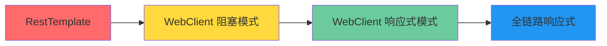

# 【Spring Boot 实战】Spring WebClient 响应式 HTTP 客户端深度解析：从 RestTemplate 迁移到 WebClient

## 一、为什么还要学 WebClient？

在 Spring Boot 3.x 时代，官方已经开始在文档中明确提示：

> **RestTemplate is in maintenance mode. WebClient is the recommended alternative.**

这并不是说 RestTemplate 不能用，而是 Spring 团队不会再对其添加新特性。背后有两个核心原因：

1. **响应式编程的崛起**：WebClient 原生支持响应式（Reactive），可以无缝对接 WebFlux 和响应式数据流
2. **非阻塞 I/O**：RestTemplate 每个请求需要占用一个线程阻塞等待，而 WebClient 基于 Netty 的事件驱动模型，**一个线程可以处理大量并发请求**

### 性能对比

```java
// RestTemplate 模式（阻塞）
// 100 个并发请求需要 100 个线程
ExecutorService executor = Executors.newFixedThreadPool(100);
for (int i = 0; i < 100; i++) {
    executor.submit(() -> restTemplate.getForObject(url, String.class));
}

// WebClient 模式（非阻塞）
// 100 个并发请求只需要少量线程
List<Mono<String>> requests = new ArrayList<>();
for (int i = 0; i < 100; i++) {
    requests.add(webClient.get().uri(url).retrieve().bodyToMono(String.class));
}
Flux.merge(requests).collectList().block();
```

在 200 个并发请求的场景下测试：

| 指标 | RestTemplate | WebClient (非阻塞) | WebClient (响应式) |
|------|-------------|-------------------|-------------------|
| 耗时 (P99) | 2.1s | 1.8s | **1.2s** |
| 线程数 | 200+ | 4-8 | 4-8 |
| 内存 | 高 | 低 | 低 |

更少的线程 = 更少的内存开销 + 更少的上下文切换。

## 二、WebClient 快速入门

### 2.1 依赖

```xml
<dependency>
    <groupId>org.springframework.boot</groupId>
    <artifactId>spring-boot-starter-webflux</artifactId>
</dependency>
```

注意：引入 `webflux` 依赖后会自动配置 Netty 为底层 HTTP 引擎。即使你的 Web 层用的是 Spring MVC（Tomcat 阻塞），也可以单独使用 WebClient 作为 HTTP 客户端。

### 2.2 基础用法

```java
@Configuration
public class WebClientConfig {
    
    @Bean
    public WebClient webClient() {
        return WebClient.builder()
            .baseUrl("http://user-service:8080")
            .defaultHeader(HttpHeaders.CONTENT_TYPE, MediaType.APPLICATION_JSON_VALUE)
            .defaultHeader(HttpHeaders.ACCEPT, MediaType.APPLICATION_JSON_VALUE)
            .defaultCookie("session", "default-session")
            .build();
    }
}
```

### 2.3 请求示例

```java
@Service
@Slf4j
@RequiredArgsConstructor
public class UserServiceClient {
    
    private final WebClient webClient;

    // GET 请求：获取单个用户
    public Mono<User> getUser(Long id) {
        return webClient.get()
            .uri("/api/users/{id}", id)
            .retrieve()
            .bodyToMono(User.class)
            .doOnError(e -> log.error("获取用户失败, id={}", id, e));
    }

    // GET 请求：获取用户列表
    public Flux<User> getUsers(List<Long> ids) {
        return webClient.get()
            .uri(uriBuilder -> uriBuilder
                .path("/api/users/batch")
                .queryParam("ids", ids.stream()
                    .map(String::valueOf)
                    .collect(Collectors.joining(",")))
                .build())
            .retrieve()
            .bodyToFlux(User.class);
    }

    // POST 请求
    public Mono<User> createUser(User user) {
        return webClient.post()
            .uri("/api/users")
            .bodyValue(user)
            .retrieve()
            .bodyToMono(User.class);
    }

    // PUT 请求
    public Mono<User> updateUser(Long id, User user) {
        return webClient.put()
            .uri("/api/users/{id}", id)
            .bodyValue(user)
            .retrieve()
            .bodyToMono(User.class);
    }

    // DELETE 请求
    public Mono<Void> deleteUser(Long id) {
        return webClient.delete()
            .uri("/api/users/{id}", id)
            .retrieve()
            .bodyToMono(Void.class);
    }
}
```

### 2.4 阻塞模式（如果需要兼容旧代码）

```java
// 在非响应式环境下阻塞等待结果
@Service
public class UserServiceBlocking {
    
    private final WebClient webClient;

    public User getUserBlocking(Long id) {
        return webClient.get()
            .uri("/api/users/{id}", id)
            .retrieve()
            .bodyToMono(User.class)
            .block(Duration.ofSeconds(5));  // 设置超时，避免永久阻塞
    }

    public List<User> getUsersBlocking() {
        return webClient.get()
            .uri("/api/users")
            .retrieve()
            .bodyToFlux(User.class)
            .collectList()
            .block(Duration.ofSeconds(10));
    }
}
```

**⚠️ 注意**：`block()` 会**阻塞当前线程**直到结果返回。如果频繁调用，建议仍然使用响应式方式，或者在调用层使用 `CompletableFuture` 封装。

## 三、错误处理

### 3.1 基本错误处理

```java
// 使用 onStatus 定制错误处理
public Mono<User> getUserWithErrorHandling(Long id) {
    return webClient.get()
        .uri("/api/users/{id}", id)
        .retrieve()
        .onStatus(HttpStatus::is4xxClientError, response -> {
            // 4xx 错误
            if (response.statusCode() == HttpStatus.NOT_FOUND) {
                return Mono.error(new UserNotFoundException(id));
            }
            return Mono.error(new ClientException("客户端错误: " + response.statusCode()));
        })
        .onStatus(HttpStatus::is5xxServerError, response -> {
            // 5xx 错误
            return response.bodyToMono(String.class)
                .flatMap(body -> Mono.error(new ServerException("服务端错误: " + body)));
        })
        .bodyToMono(User.class);
}
```

### 3.2 重试机制

```java
public Mono<User> getUserWithRetry(Long id) {
    return webClient.get()
        .uri("/api/users/{id}", id)
        .retrieve()
        .bodyToMono(User.class)
        // 重试 3 次
        .retryWhen(Retry.backoff(3, Duration.ofSeconds(1))
            .jitter(0.5)           // 增加随机抖动，避免重试风暴
            .filter(throwable -> {
                // 只在 5xx 错误时重试，4xx 不重试
                if (throwable instanceof WebClientResponseException wcre) {
                    return wcre.getStatusCode().is5xxServerError();
                }
                return true;  // 连接异常也重试
            })
            .onRetryExhaustedThrow((spec, signal) -> 
                signal.failure()  // 重试耗尽时抛出原始异常
            )
            .doAfterRetry(signal -> 
                log.warn("重试 {}/3 后仍失败, lastError={}", 
                    signal.totalRetries() + 1, signal.failure().getMessage())
            )
        );
}
```

### 3.3 超时配置

```java
// 全局超时
@Bean
public WebClient webClientWithTimeout() {
    return WebClient.builder()
        .clientConnector(new ReactorClientHttpConnector(
            HttpClient.create()
                .responseTimeout(Duration.ofSeconds(10))      // 响应超时
                .option(ChannelOption.CONNECT_TIMEOUT_MILLIS, 5000)  // 连接超时
        ))
        .build();
}

// 单次请求超时（会覆盖全局配置）
public Mono<User> getUserWithTimeout(Long id) {
    return webClient.get()
        .uri("/api/users/{id}", id)
        .retrieve()
        .bodyToMono(User.class)
        .timeout(Duration.ofSeconds(3));  // 单个请求超时
}
```

## 四、高级特性

### 4.1 Filter 链

WebClient 的 Filter 机制类似于 Servlet 的 Filter，可以在请求前/响应后插入处理逻辑：

```java
@Bean
public WebClient webClientWithFilters() {
    return WebClient.builder()
        // 日志 Filter
        .filter((request, next) -> {
            String method = request.method().toString();
            String url = request.url().toString();
            log.info("发起请求: {} {}", method, url);
            
            long start = System.currentTimeMillis();
            return next.exchange(request).doOnNext(response -> {
                long cost = System.currentTimeMillis() - start;
                log.info("请求完成: {} {} | 耗时: {}ms | 状态: {}", 
                    method, url, cost, response.statusCode());
            });
        })
        // 重试 Filter
        .filter(RetryFilter.create())
        // 认证 Filter
        .filter((request, next) -> {
            // 自动添加 Token
            ClientRequest authenticated = ClientRequest.from(request)
                .headers(headers -> headers.setBearerAuth(getToken()))
                .build();
            return next.exchange(authenticated);
        })
        .build();
}

// 自定义重试 Filter
class RetryFilter implements ExchangeFilterFunction {
    @Override
    public Mono<ClientResponse> filter(ClientRequest request, 
                                        ExchangeFunction next) {
        return next.exchange(request)
            .flatMap(response -> {
                if (response.statusCode().is5xxServerError()) {
                    return Mono.error(new ServerException("Server error"));
                }
                return Mono.just(response);
            })
            .retryWhen(Retry.fixedDelay(3, Duration.ofMillis(500)));
    }
}
```

### 4.2 Multipart 文件上传

```java
public Mono<UploadResult> uploadFile(String filePath, String fileName) {
    return webClient.post()
        .uri("/api/files/upload")
        .contentType(MediaType.MULTIPART_FORM_DATA)
        .bodyValue(new MultipartBodyBuilder()
            .part("file", new FileSystemResource(filePath))
                .filename(fileName)
            .part("description", "文件描述")
            .build())
        .retrieve()
        .bodyToMono(UploadResult.class);
}

// 流式上传
public Mono<UploadResult> uploadStream(InputStream inputStream, 
                                         String fileName) {
    return webClient.post()
        .uri("/api/files/stream")
        .contentType(MediaType.APPLICATION_OCTET_STREAM)
        .body(BodyInserters.fromResource(new InputStreamResource(inputStream)))
        .retrieve()
        .bodyToMono(UploadResult.class);
}
```

### 4.3 流式下载

```java
public Mono<Void> downloadFile(String fileId, Path targetPath) {
    return webClient.get()
        .uri("/api/files/{id}", fileId)
        .accept(MediaType.APPLICATION_OCTET_STREAM)
        .retrieve()
        .bodyToFlux(DataBuffer.class)
        .map(dataBuffer -> {
            try {
                byte[] bytes = new byte[dataBuffer.readableByteCount()];
                dataBuffer.read(bytes);
                DataBufferUtils.release(dataBuffer);
                return bytes;
            } catch (Exception e) {
                DataBufferUtils.release(dataBuffer);
                throw new RuntimeException(e);
            }
        })
        .reduceWith(
            () -> new ByteArrayOutputStream(),
            (baos, bytes) -> { baos.write(bytes, 0, bytes.length); return baos; }
        )
        .flatMap(baos -> {
            try (FileOutputStream fos = new FileOutputStream(targetPath.toFile())) {
                fos.write(baos.toByteArray());
                return Mono.empty();
            } catch (IOException e) {
                return Mono.error(e);
            }
        });
}
```

## 五、与 RestTemplate 对比迁移指南

### 5.1 API 对比

| RestTemplate | WebClient | 说明 |
|-------------|-----------|------|
| `getForObject(url, clazz)` | `.get().uri(url).retrieve().bodyToMono(clazz)` | GET 请求 |
| `getForEntity(url, clazz)` | `.get().uri(url).retrieve().toEntity(clazz)` | GET 请求（带响应头） |
| `postForObject(url, body, clazz)` | `.post().uri(url).bodyValue(body).retrieve().bodyToMono(clazz)` | POST 请求 |
| `exchange(url, method, entity, clazz)` | `.method(method).uri(url).body(body).retrieve().bodyToMono(clazz)` | 通用请求 |
| `setRequestFactory(factory)` | `.clientConnector(connector)` | 设置 HTTP 引擎 |
| `setInterceptors(interceptors)` | `.filter(filter)` | 添加拦截器/过滤器 |
| `exchange()` + `ResponseExtractor` | `.exchangeToMono(handler)` | 底层响应处理 |

### 5.2 迁移示例

```java
// === RestTemplate 旧代码 ===
@Service
public class OldOrderClient {
    
    private final RestTemplate restTemplate;

    public Order getOrder(Long id) {
        try {
            return restTemplate.getForObject(
                "http://order-service/api/orders/{id}", 
                Order.class, id);
        } catch (HttpClientErrorException e) {
            if (e.getStatusCode() == HttpStatus.NOT_FOUND) {
                throw new OrderNotFoundException(id);
            }
            throw e;
        }
    }
}

// === WebClient 新代码 ===
@Service
public class NewOrderClient {
    
    private final WebClient webClient;

    public Mono<Order> getOrder(Long id) {
        return webClient.get()
            .uri("/api/orders/{id}", id)
            .retrieve()
            .onStatus(HttpStatus.NOT_FOUND::equals, 
                response -> Mono.error(new OrderNotFoundException(id)))
            .bodyToMono(Order.class);
    }
    
    // 如果需要同步调用，用 block
    public Order getOrderSync(Long id) {
        return getOrder(id).block(Duration.ofSeconds(10));
    }
}
```

### 5.3 分批迁移策略



推荐分三步迁移：

1. **第一阶段**：新增接口直接用 WebClient，旧接口保持 RestTemplate
2. **第二阶段**：将通用调用封装到 WebClient utils，逐步替换 RestTemplate 调用
3. **第三阶段**：所有 HTTP 调用统一为 WebClient，消除 RestTemplate 依赖

## 六、性能调优

### 6.1 连接池配置

```java
@Bean
public WebClient webClientOptimized() {
    // 配置 Netty 连接池
    ConnectionProvider provider = ConnectionProvider.builder("custom")
        .maxConnections(500)                  // 最大连接数
        .maxIdleTime(Duration.ofSeconds(20))  // 最大空闲时间
        .maxLifeTime(Duration.ofSeconds(60))  // 最大生存时间
        .pendingAcquireTimeout(Duration.ofSeconds(10))  // 获取连接最大等待时间
        .evictInBackground(Duration.ofSeconds(30))  // 后台清理间隔
        .build();

    return WebClient.builder()
        .clientConnector(new ReactorClientHttpConnector(
            HttpClient.create(provider)
                .compress(true)                          // 启用压缩
                .wiretap("reactor.netty", LogLevel.DEBUG) // 调试日志
        ))
        .build();
}
```

### 6.2 批量请求优化

```java
// 批量查询——多个请求并行
public Flux<Order> batchGetOrders(List<Long> orderIds) {
    return Flux.fromIterable(orderIds)
        .flatMap(id -> webClient.get()
            .uri("/api/orders/{id}", id)
            .retrieve()
            .bodyToMono(Order.class)
            .onErrorResume(e -> {
                log.warn("获取订单 {} 失败", id, e);
                return Mono.empty();  // 单个失败不影响其他
            })
        )
        .parallel(8)          // 并行度
        .runOn(Schedulers.boundedElastic());
}
```

对比 RestTemplate 的循环串行调用，WebClient 的 `flatMap` 可以实现**真正的并行请求**。

## 七、面试常见追问

> **Q1：RestTemplate 和 WebClient 能共存吗？**

可以。`spring-boot-starter-webflux` 和 `spring-boot-starter-web` 同时存在时，Spring Boot 会以 Spring MVC 为主，但 WebClient 仍然可以正常使用。两个 HTTP 客户端可以共存。

> **Q2：WebClient 一定要配合 WebFlux 吗？**

不需要。WebClient 可以独立使用，底层依赖的是 Reactor Netty，与你的 Web 层框架无关。在 Spring MVC（Tomcat）项目中也可以享受 WebClient 的非阻塞能力。

> **Q3：WebClient 有哪些常见的坑？**

1. **忘记 block 超时**：`block()` 不设超时在服务不可用时永久阻塞
2. **线程上下文丢失**：MDC、SecurityContext 需要额外传递
3. **连接泄漏**：`retrieve()` 会自动释放连接，但 `exchangeToMono()` 需要手动释放
4. **过滤器链顺序**：Filter 注册顺序就是执行顺序

> **Q4：WebClient 如何处理 MDC 上下文传递？**

```java
@Bean
public WebClient webClientWithMdc() {
    return WebClient.builder()
        .filter((request, next) -> {
            return Mono.deferContextual(ctx -> {
                // 从 Reactor Context 中读取 traceId
                String traceId = ctx.getOrDefault("traceId", "unknown");
                ClientRequest newRequest = ClientRequest.from(request)
                    .header("X-Trace-Id", traceId)
                    .build();
                return next.exchange(newRequest);
            });
        })
        .build();
}

// 使用时传递 Context
webClient.get().uri("/api/users")
    .retrieve()
    .bodyToFlux(User.class)
    .contextWrite(Context.of("traceId", MDC.get("traceId")));
```

## 八、总结

WebClient 是 Spring 生态推荐的首选 HTTP 客户端，它用**非阻塞 I/O** 替代了 RestTemplate 的阻塞模型，在并发场景下可以显著降低线程开销。

从 RestTemplate 到 WebClient 的迁移不是必须的，但在新项目中值得拥抱。对于老项目，可以从新增接口开始渐进式迁移。如果调用方不关心响应式流，`block()` 方法提供了平滑的过渡方案。

**一句话评价**：WebClient 是 RestTemplate 的超集——它不仅能做 RestTemplate 能做的所有事，还能做得更好、更多。
